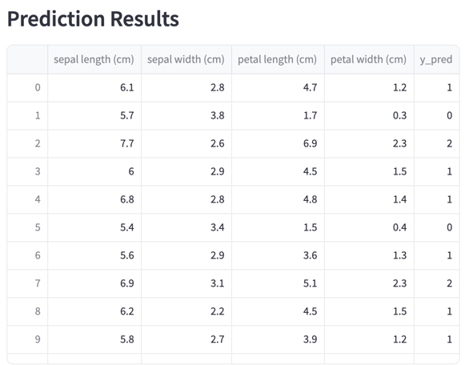
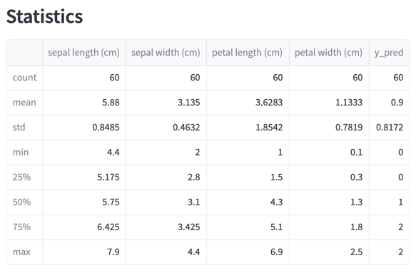
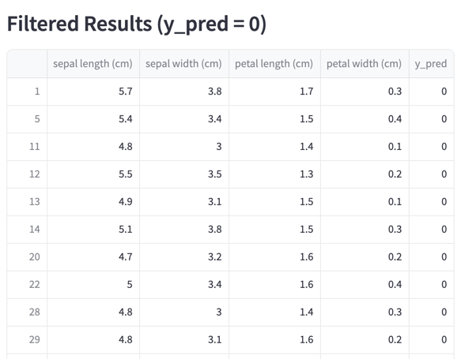
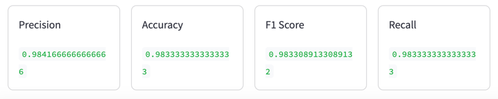

# mi-ops

The project's goal is to show an User Interface (UI) that interactively displays the results of a machine learning (ML) model hosted on a server.
The application allows users to analyze new data and provides easy access to the model's predictions.

Key functionalities of the server:

**MLflow Integration:** The server can load stored models from an MLflow server.

**RabbitMQ:** RabbitMQ is used as a message broker for asynchronous communication, enabling scalability and efficient background process management.
The collaboration between the UI and the server supports both interactive visualization and real-time data processing.

This solution can be used as a base project for applications requiring effective data management, and real-time analytics.

### File structure

```angular2html
mi-ops/
├── app/                      # Application layer, including UI and server logic
│   ├── __init__.py
│   ├── ui.py                 # User Interface logic
│   └── server.py             # Server-side logic for handling predictions and routing
│
├── models/                   # Model-related logic and operations
│   ├── load_model.py         # Directory for handling loading model from mlflow
│   └── model.py              # Training, saving, and processing models to mlflow
│
├── messaging/                # Messaging and communication logic (e.g., RabbitMQ-related code)
│   ├── __init__.py
│   └── commands.py           # Builds up RabbitMQ channels and connection
│
├── .gitignore                # Specifies files and directories to ignore in version control
├── README.md                 # Documentation about the project, including setup and usage instructions
└── requirements.txt          # Lists the Python dependencies required for the project
```
# Usage

### Requirements
Install requirement packages from the requirements.txt file

```pip install -r requirements.txt```

### MLflow

Start a local server that tracks our model activity

```mlflow server```

The mlruns folder will appear in our directory, where the results of different runs will be stored.
The User Interface for MLflow can typically be accessed via the following link:

http://127.0.0.1:5000.

### Model

Create a model for Iris dataset and save it MLflow.
Use the following command in the **mi-ops/models** folder:

```python model.py```

The code created a model and stored the model parameters in the artifacts folder of MLflow.
You can get the run id in the **Overview** folder.


### Server

In the mi-ops/app folder start the server with the help of the following command:

```python server.py```

Now the server is running, end point are ready for handling incoming messages.

The endpoint documentation can be reached at the following local link:

http://localhost:8000/docs

The server also initializes the **rabbitMQ** connections and adjust the channels for communications.

#### Get MLflow model endpoint: /model/{runId}

It loads the model data for the given run by the run ID.

#### Predict endpoint: /model/{queue}

It predicts the new results for the incoming new input and it uses the previously loaded model for that.
It also calculates the metrics for the given input.

### User Interface

I used the streamlite package for the creation of the user interface for handling new model input and showing results.

In the **mi-ops/app** folder run the following command.

```streamlit run ui.py```

1. First load the model by your run Id at the UI.

2. Load the iris_random_60_samples.csv file for test.

After the load succeeded, you can see the result metrics and other analytics.










